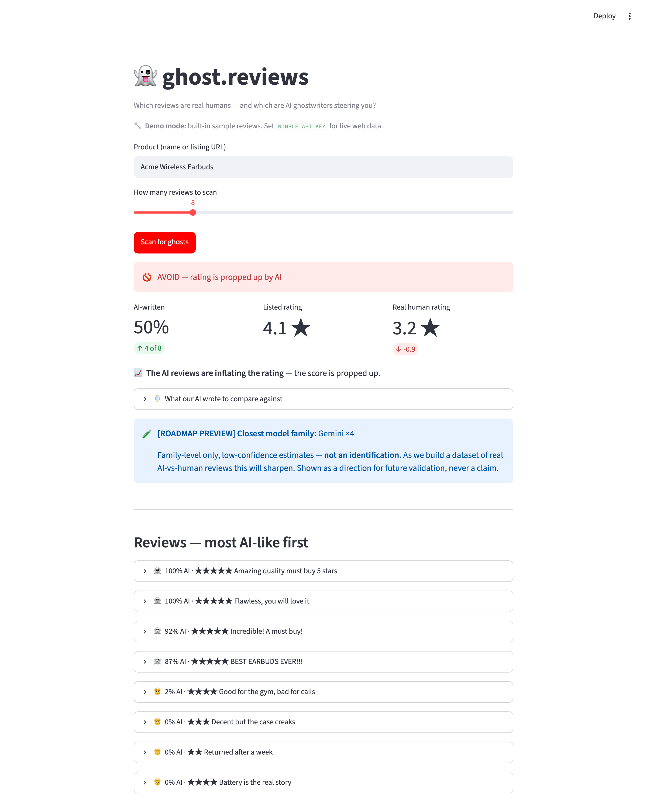

# 👻 ghost.reviews

**Paste a product's reviews → AI exposes the fakes ("ghost" reviews) → you get a trust verdict + the real human-vs-AI rating gap.**



> 🎬 [Watch the 35-sec demo](media/demo.mp4) · 🔴 [Live app](https://ghost-reviews.streamlit.app/)

Built for the DeveloperWeek New York 2026 Hackathon — submitted to three sponsor challenges:

| Sponsor | How we use it |
|---|---|
| **name.com** | The product *is* the domain **ghost.reviews** (drawn from name.com's Domain Roulette) — "ghost" = the phantom AI ghostwriter behind a fake review; ".reviews" = the medium. The name is the concept. |
| **Nimble** | `ghost/nimble_client.py` calls Nimble's **Search API** to pull **real reviews from across the live web** (Trustpilot, Reddit, retailer pages, forums) — those live reviews are what the engine tears apart. When the product maps to an Amazon listing, it also calls Nimble's **`amazon_pdp` agent** for the listing's *real* listed rating + star distribution (aggregate context only — never used to fake the per-review human-vs-AI gap). |
| **Tower** | `run_pipeline.py` + `Towerfile` deploy the review-scoring pipeline as a serverless Python app on Tower, with secrets, a daily schedule, and an Apache Iceberg lakehouse table (`ghost_scans`). |

> **A note on the two modes (both honest):**
> - **Live mode** (set `NIMBLE_API_KEY`): ghost.reviews pulls **real reviews from the live web via Nimble** and runs the full per-review human-vs-AI teardown on them. The trust verdict rests on that detection; the human-vs-AI **rating gap** fills in only when the source exposes per-review star ratings.
> - **Sample mode** (zero keys): a built-in **representative dataset** of reviews *with* star ratings, so you can see the complete **rating-gap** verdict (e.g. *humans 3.2★ vs listed 4.1★ → AVOID*) end-to-end. The dashboard shows a clear mode badge so the two are never confused.

---

## How it works

```
  product + its reviews
      │
      ▼
 [ Reviews ]  live web pull via Nimble (or sample)   (ghost/nimble_client.py)
      │
      ▼
 [ Engine ]   scores each review 0–100 "ghost"      (ghost/detector.py)
      │           + red-flag reasons
      ▼
 [ Output ]   Ghost Score + flagged reviews         (ghost/pipeline.py)
      │
      ├── dashboard  → app.py   (the demo)
      └── Tower run  → ghost_results.json / Iceberg lakehouse
```

---

## Quick start (local — for the demo video)

```bash
cd ghost-reviews
python -m venv .venv && source .venv/bin/activate
pip install -r requirements.txt

streamlit run app.py        # runs immediately in free SAMPLE mode — no keys
```

It runs with **zero keys** on a built-in representative review set (the dashboard shows a
"Sample mode" badge). Optionally `cp .env.example .env` and set:
- `NIMBLE_API_KEY` → flips to **live mode**: real reviews pulled from the web via Nimble
- `ANTHROPIC_API_KEY` → upgrades the teardown from the free rule engine to Claude

Type a product, hit **Scan for ghosts**, record the screen. Done.

CLI version (no UI):

```bash
GHOST_PRODUCT="Acme Wireless Earbuds" python -m ghost.pipeline
```

---

## Deploy to Tower (for the Tower challenge)

Each run lands one summary row in the **Iceberg lakehouse** table `ghost_scans`
(via `ghost/lakehouse.py`) — so scheduled re-scans build a history of how each
product's Ghost Score moves over time. That history table is the data-flywheel
the roadmap depends on, and the "data lands in storage" story Tower judges want.

```bash
pip install -U "tower[iceberg]"
tower login

# 1. (once) make sure your account has a default Iceberg catalog
#    Tower dashboard -> Catalogs -> create one if you don't have it.

# 2. (optional) store an Anthropic key as a Tower secret for the Claude teardown
tower secrets create --name=ANTHROPIC_API_KEY --value=...   # optional (Claude teardown)

# 3. deploy + run
tower apps create --name=ghost-reviews
tower deploy
tower run --parameter=product="Acme Wireless Earbuds" --parameter=max_results="10"
tower apps logs ghost-reviews#1
```

The run prints `lakehouse: upserted 'Acme Wireless Earbuds' (YYYY-MM-DD) -> ghost_scans`.
Inspect the table from the Tower dashboard (Catalogs → ghost_scans) or with the
read examples in `tower-examples`.

**Schedule it** (daily history): in the Tower dashboard, add a schedule to the
`ghost-reviews` app (e.g. daily) — the write is an upsert keyed on
`(product, scanned_date)`, so same-day re-runs update the row instead of
duplicating it.

> Local runs without a catalog simply skip the lakehouse write and still produce
> `ghost_results.json`, so the demo is unaffected.

---

## Keys you need
None for the demo — it runs free on the built-in representative review set.
- **NIMBLE_API_KEY** (optional) — flips to live mode: pulls real reviews from the web via Nimble's Search API
- **ANTHROPIC_API_KEY** (optional) — upgrades the teardown from the rule engine to Claude

## Files
- `ghost/nimble_client.py` — review source: live web pull via Nimble's Search API, or the built-in representative set
- `ghost/detector.py` — adversarial teardown: human-vs-AI score + reasons + self-written baselines + family preview
- `ghost/model_profiles.py` — how each model family tends to write (the "fingerprint" knowledge)
- `ghost/lakehouse.py` — upserts each scan summary into the Tower Iceberg table `ghost_scans`
- `ghost/pipeline.py` — orchestration + persistence (Tower entry logic)
- `run_pipeline.py` + `Towerfile` — Tower deployment
- `app.py` — Streamlit dashboard (the demo)
